## 📊 Project Presentation

  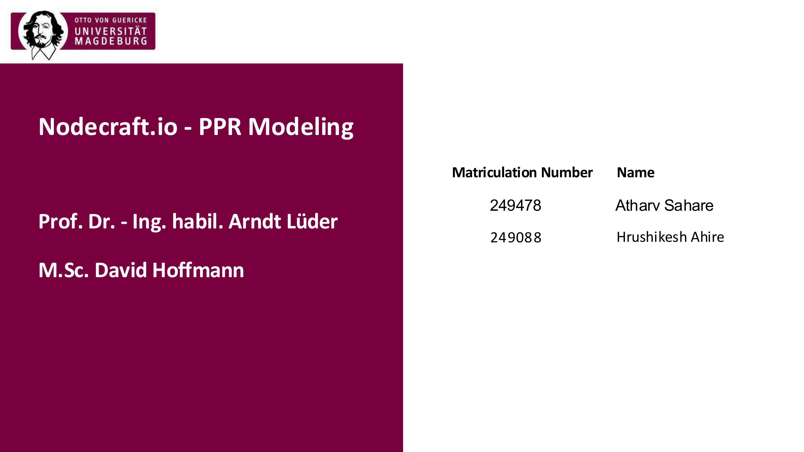  
  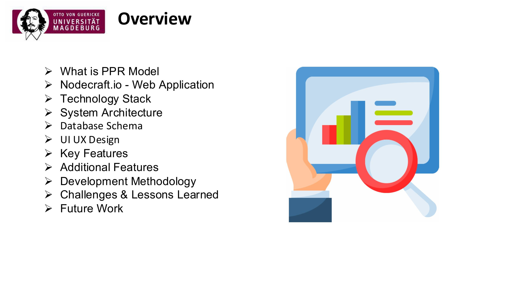  
  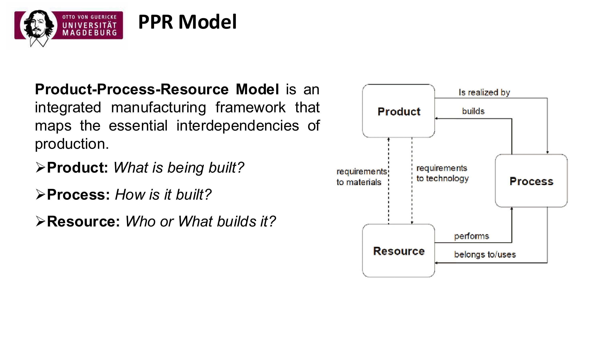  
  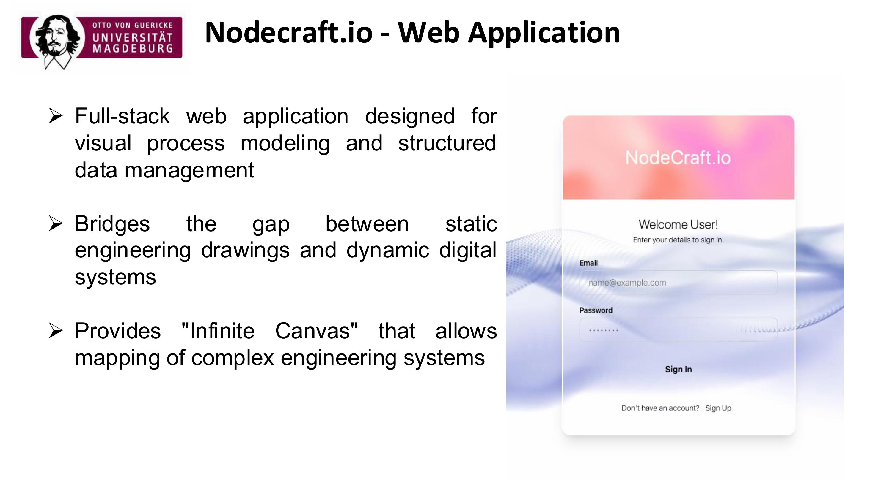  
  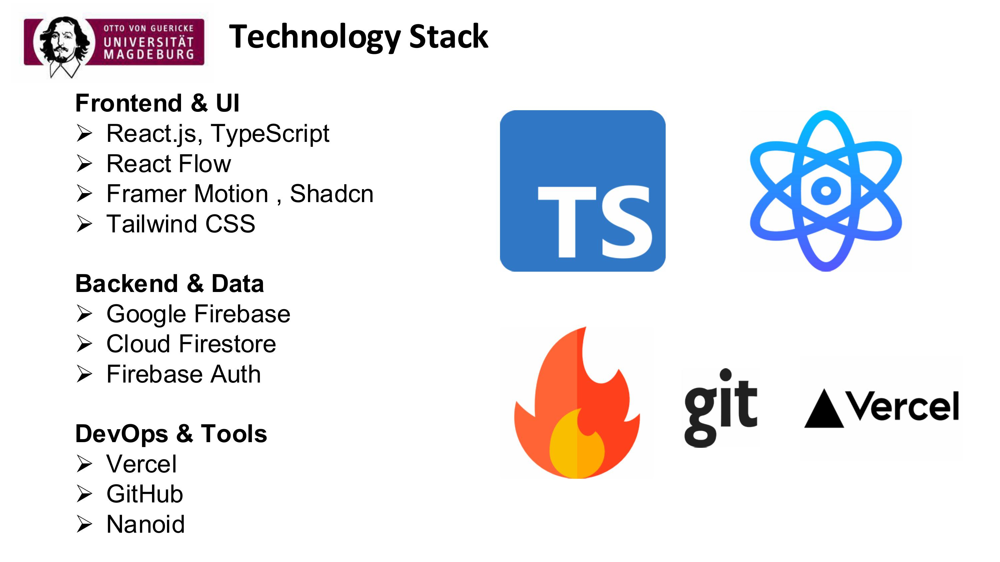  
  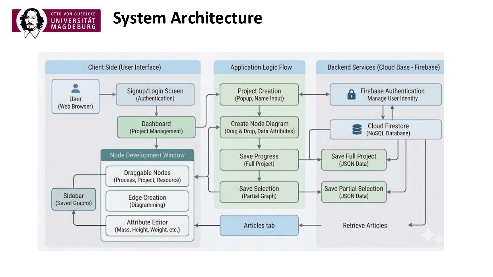  
  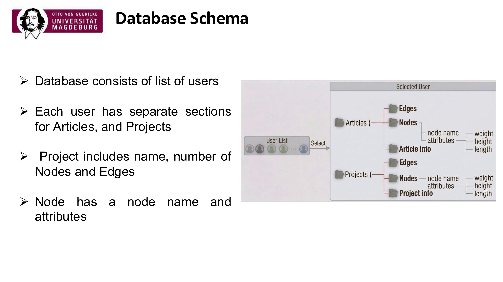  
   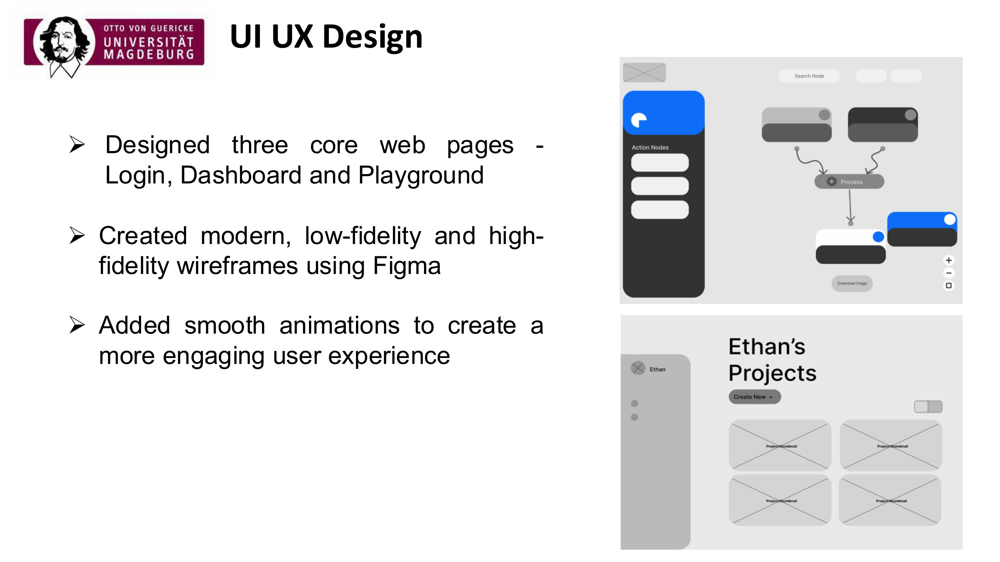  
  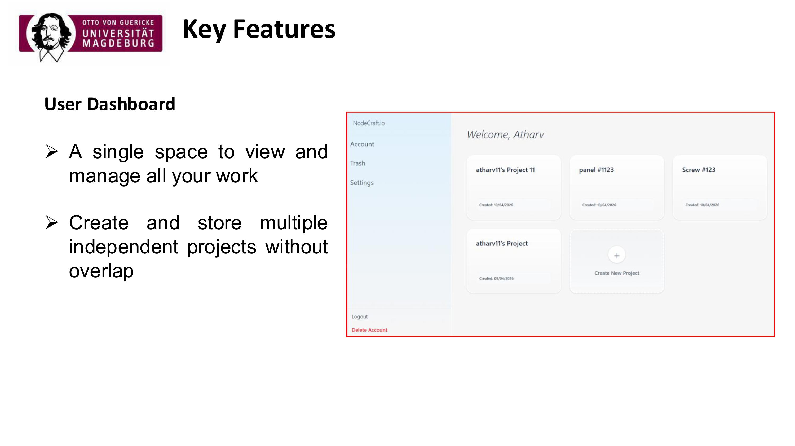  
  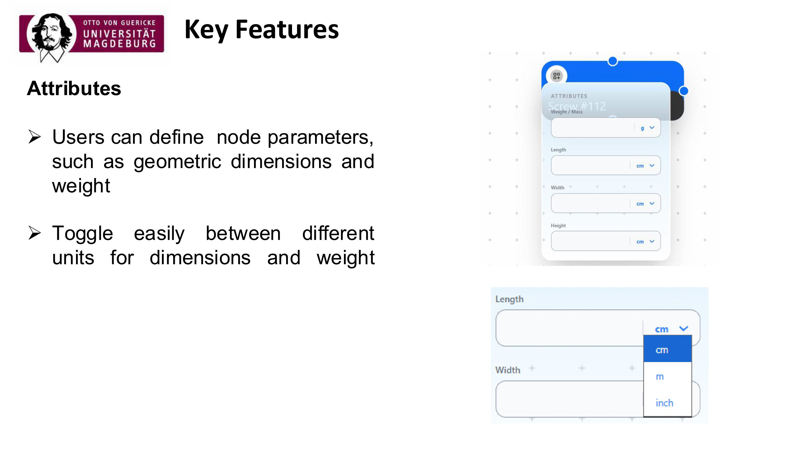  
  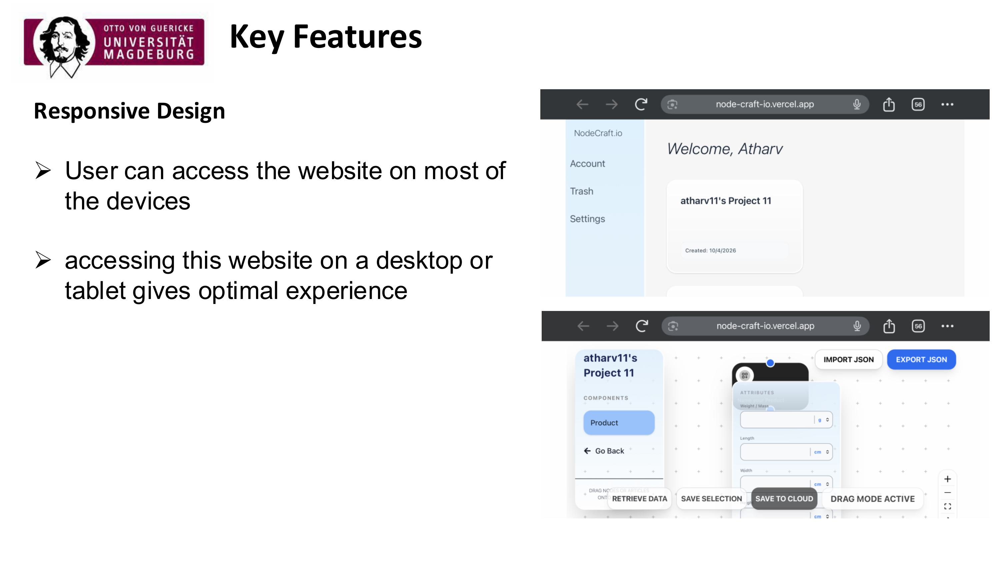  
  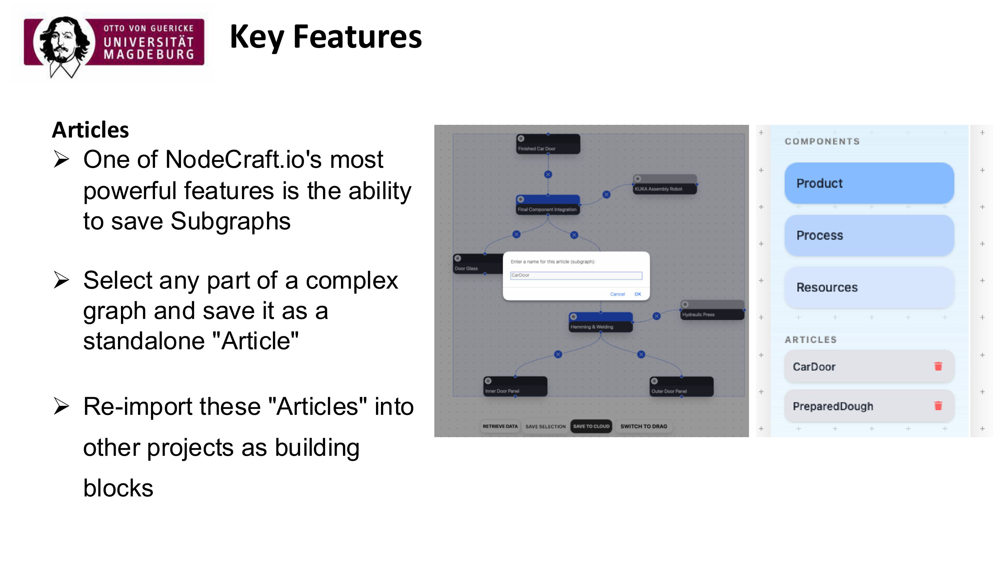  
  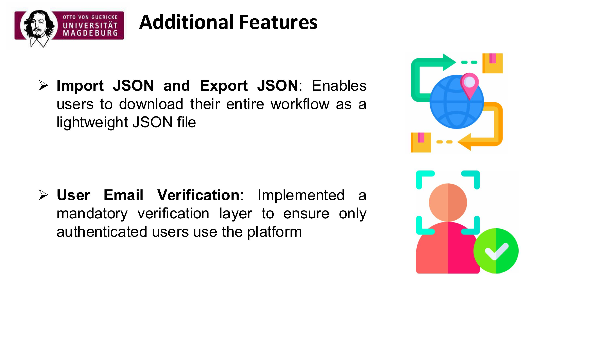  
  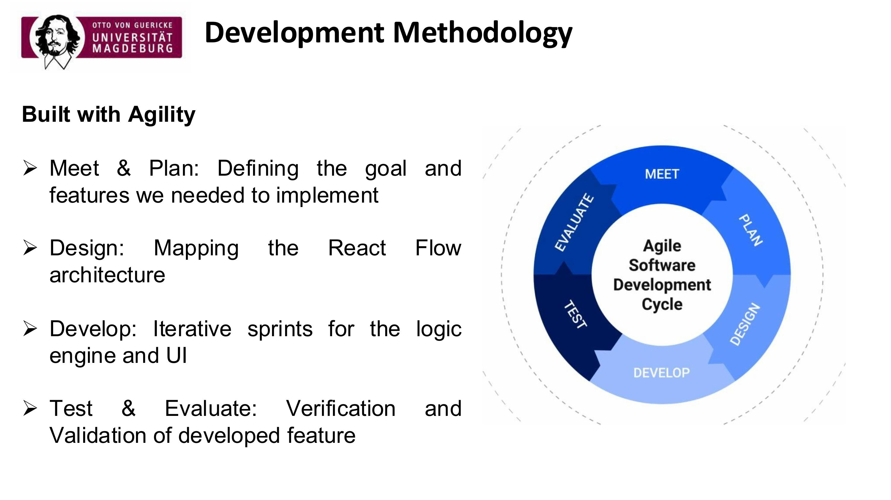  
    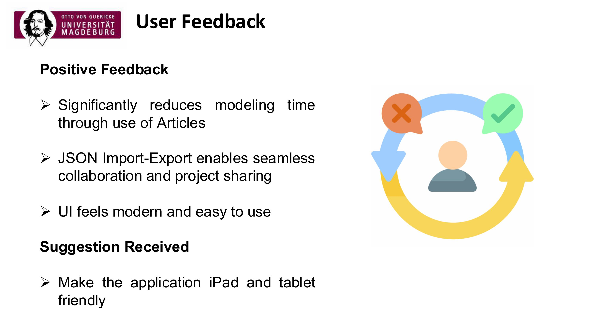  
  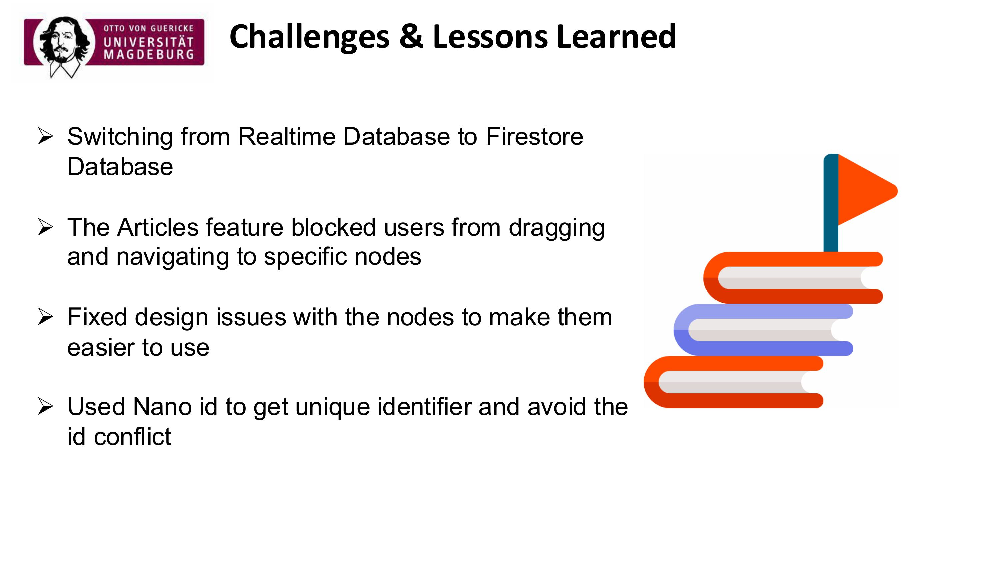  
  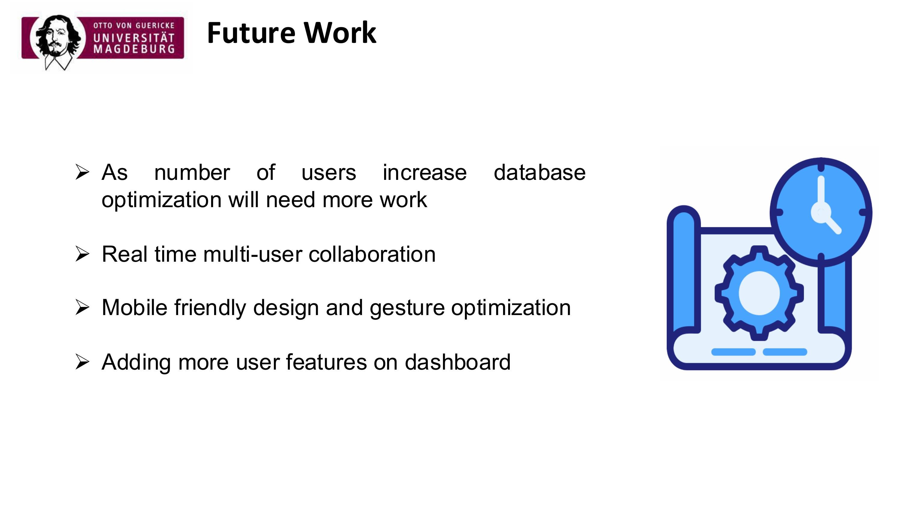  
  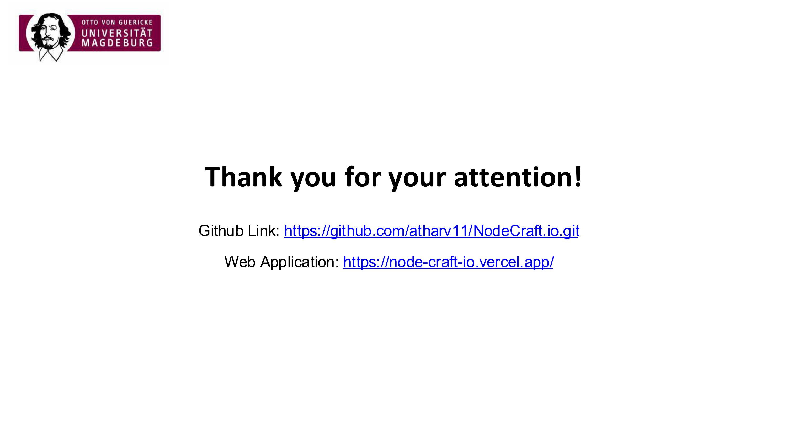  

## 📊 Project Presentation

You can view the full presentation presented to the professor here: [Download/View Presentation PDF](NodeCraft-PPR-Modeling.pdf)
